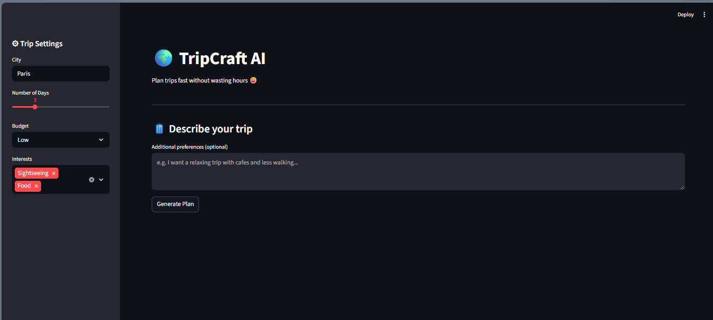
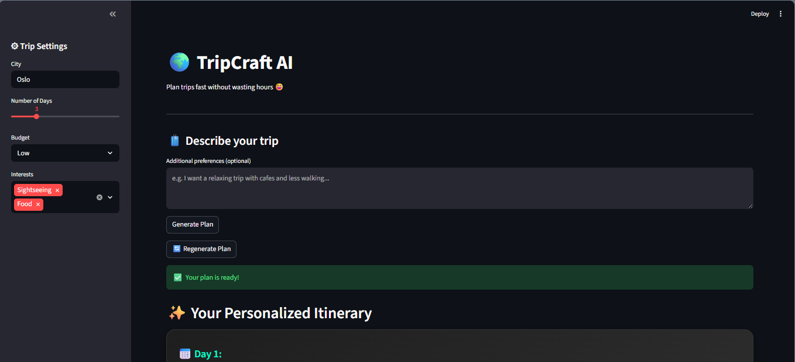
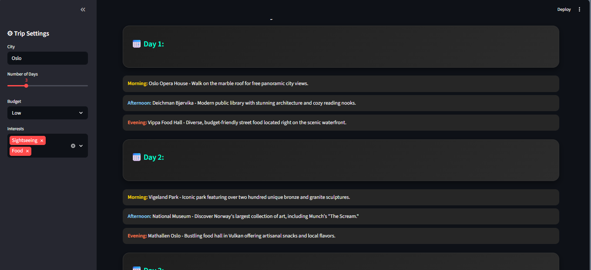
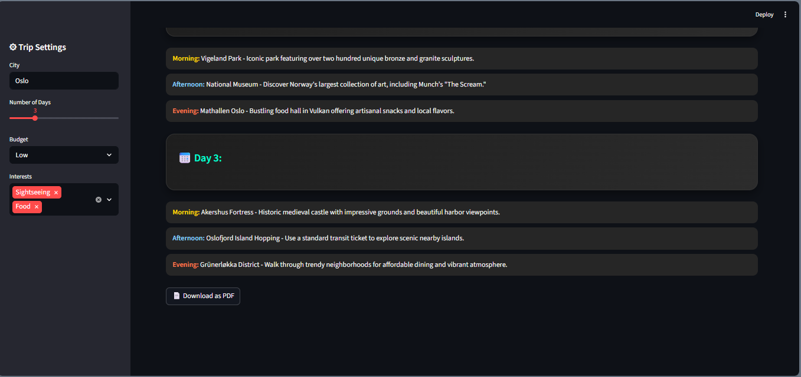

# 🌍 TripCraft AI

AI-powered travel planner that generates structured multi-day itineraries with a modern UI and PDF export using Streamlit and Gemini API.

---

## 🚀 Live Demo
👉 https://tripcraft-ai-km7wgmh6tsyhr5vzmfmmcr.streamlit.app/

---

## ✨ Features

- 📅 Day-wise itinerary generation  
- 🎯 Personalized plans based on user preferences  
- 🎨 Clean card-based UI design  
- 🔁 Regenerate travel plans instantly  
- 📄 Download itinerary as PDF  
- ⚡ Demo mode support (works even without API key)  

---

## 📸 Screenshots

### 🏠 Home Screen


---

### 🧳 Trip Input Section


---

### ✨ Generated Itinerary


---

### 📅 Day-wise Breakdown


---

## 🛠 Tech Stack

- Python  
- Streamlit  
- Gemini API  
- ReportLab  

---

## ⚙️ How to Run Locally

```bash
pip install -r requirements.txt
streamlit run app.py
